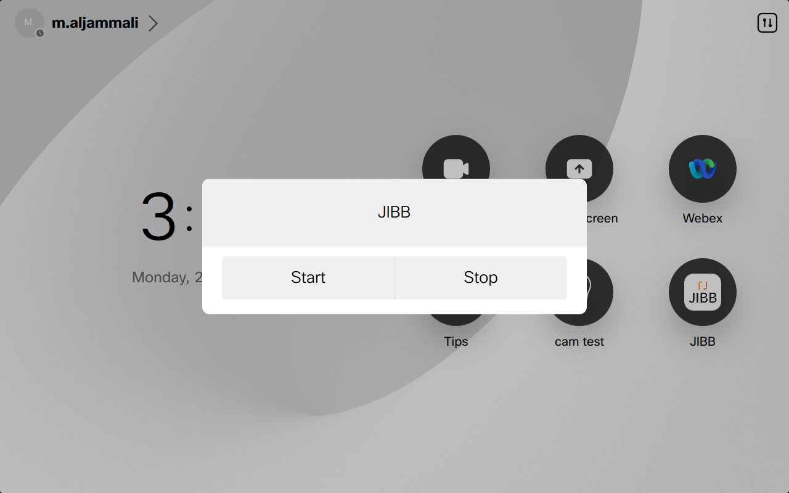
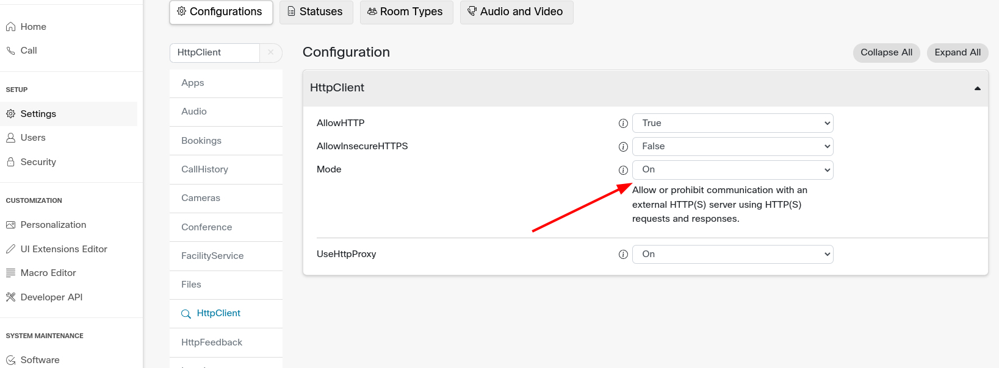
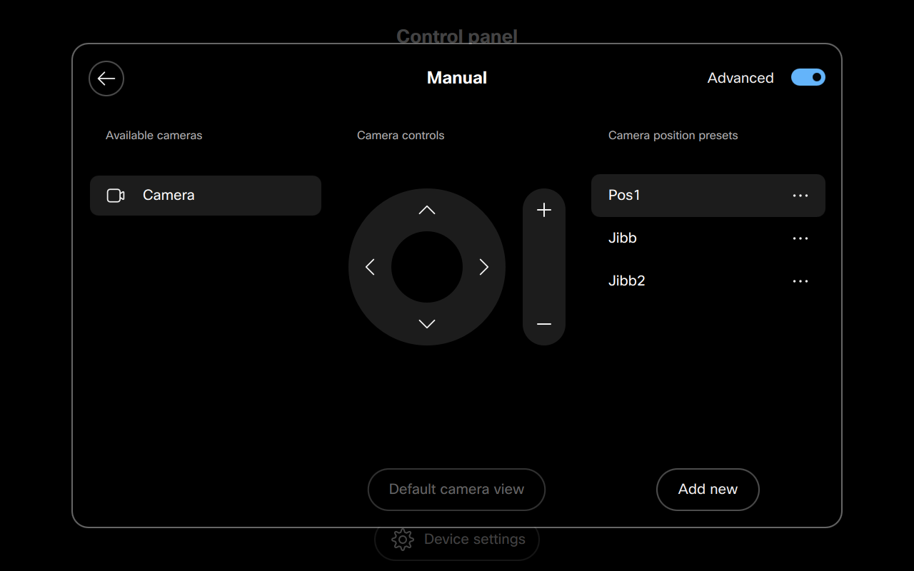
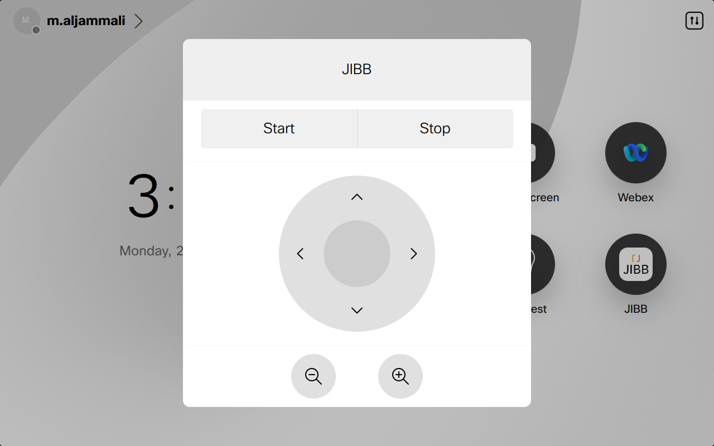
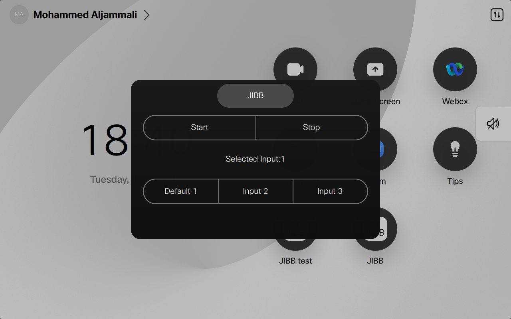
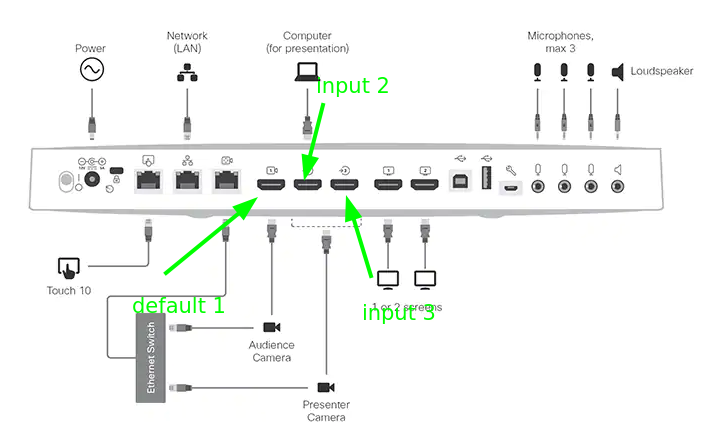
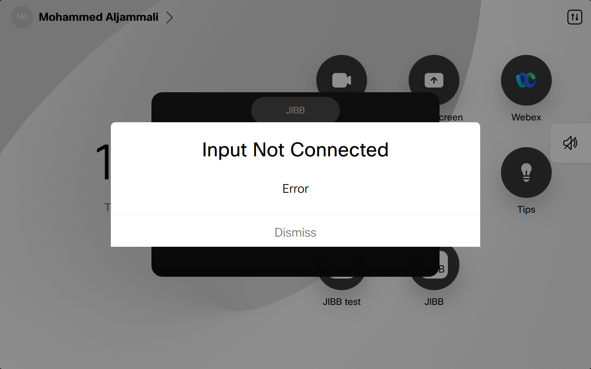
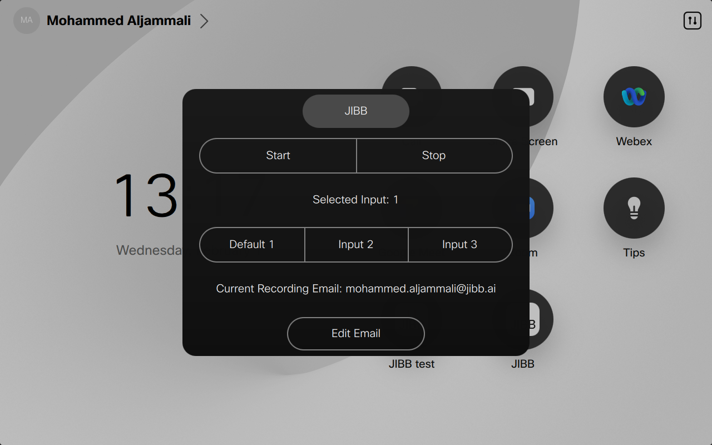
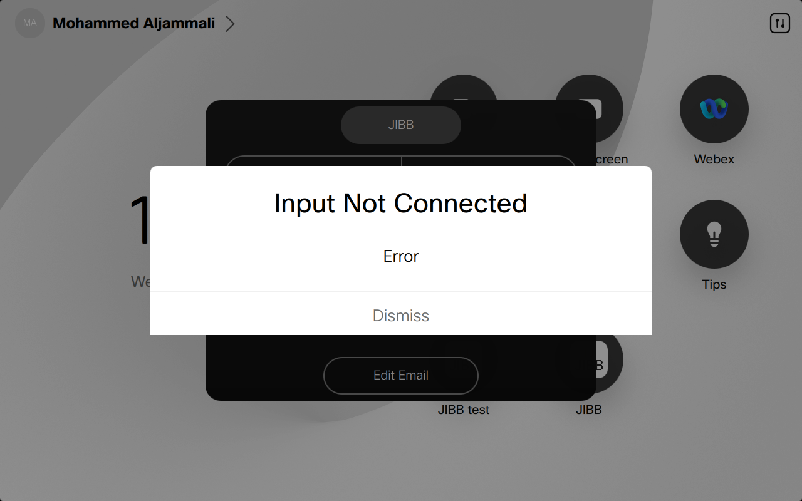
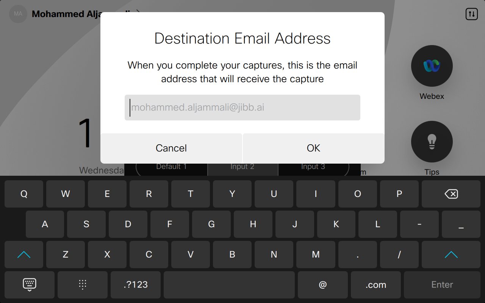

####  1-webexDeviceExample
test
webex Device Macro simple example.
----------------------------------

The device user should be able to walk into the meeting room, tap on the JIBB icon on the UI and it will automatically snap to the whiteboard and start detecting/sharing the JIBB Workspace.

### Description:

*   start and stop button.
*   camera will snap to whiteboard that admin preset.

*   Click on source to see the script example.

### File Description

*   jibb.js -> entry point
*   jibbWebexXapi.js -> JIBB library for Webex devices

### Installation

*   downalod webexMacrosExamples.zip from https://github.com/jibb-open/cisco-devices/releases.
*   Log into your Cisco Room Device as and admin.
*   Navigate to the setup -> settings -> HttpClient, set Mode to On.
*   
*   Navigate to the Macro Editor.
*   Import and Save each of the following Macros into the Room System: jibbWebexXapi.js found under jssdk folder and jibb.js from desired example.
*   Edite jibb.js by adding your personal Jibb ApiKey to in line 4, to get your ApiKey visit https://app.jibb.ai/admin then navigate to personal settings and add new Device.
*   Edite jibb.js by add desired Email to receive a pdf Recording of the session to in line 5.
*   Save and activate jibb.js .
*   After refreshing the webage you will find jibb panel automatically added in the UI Extension Editor. variable uiExtension line 193 is is the exported XML panel
*   Using touch panel create a camera preset "Jibb" (case sensitive) so that camera postion will be set automatically
*   If not set script will work but camera postions needs to be set manually before clicking start.
*   

### Click on source to see the script example.

Source:

*   [simplestExample/jibb.js](simplestExample_jibb.js.html)

####  2-webexDeviceExample camera Control

webex Device Macro camera Control example.
------------------------------------------

The device user should be able to walk into the meeting room, tap on the JIBB icon, then using the UI be able to make sure the camera is aiming at the surface and can click start to detect and share \* their writing.

### Description:

*   start and stop button.
*   camera will snap to whiteboard that admin preset.
*   user have a camera control.

*   Click on source to see the script example.

### File Description

*   jibb.js -> entry point
*   jibbWebexXapi.js -> JIBB library for Webex devices

### Installation

*   downalod webexMacrosExamples.zip from https://github.com/jibb-open/cisco-devices/releases.
*   Log into your Cisco Room Device as and admin.
*   Navigate to the setup -> settings -> HttpClient, set Mode to On.
*   
*   Navigate to the Macro Editor.
*   Import and Save each of the following Macros into the Room System: jibbWebexXapi.js found under jssdk folder and jibb.js from desired example.
*   Edite jibb.js by adding your personal Jibb ApiKey to in line 4, to get your ApiKey visit https://app.jibb.ai/admin then navigate to personal settings and add new Device.
*   Edite jibb.js by add desired Email to receive a pdf Recording of the session to in line 5.
*   Save and activate jibb.js .
*   After refreshing the webage you will find jibb panel automatically added in the UI Extension Editor. variable uiExtension line 262 is is the exported XML panel
*   Using touch panel create a camera preset "Jibb" (case sensitive) so that camera postion will be set automatically
*   If not set script will work but camera postions needs to be set manually before clicking start.
*   

### Click on source to see the script example.

Source:

*   [./withCameraControl/jibb.js](withCameraControl_jibb.js.html)

#### 3-webexDeviceExample

webex Device Macro select inputs.
---------------------------------

The device user should be able to walk into the meeting room, tap on the JIBB icon on the UI and it will automatically snap to the whiteboard and start detecting/sharing the JIBB Workspace.

### Description:

*   start and stop button.
*   can choose camera input.
*   camera will snap to whiteboard that admin preset.

  

*   Click on source to see the script example.

### File Description

*   jibb.js -> entry point
*   jibbWebexXapi.js -> JIBB library for Webex devices

### Installation

*   downalod webexMacrosExamples.zip from https://github.com/jibb-open/cisco-devices/releases.
*   Log into your Cisco Room Device as and admin.
*   Navigate to the setup -> settings -> HttpClient, set Mode to On.
*   
*   Navigate to the Macro Editor.
*   Import and Save each of the following Macros into the Room System: jibbWebexXapi.js found under jssdk folder and jibb.js from desired example.
*   Edite jibb.js by adding your personal Jibb ApiKey to in line 4, to get your ApiKey visit https://app.jibb.ai/admin then navigate to personal settings and add new Device.
*   Edite jibb.js by add desired Email to receive a pdf Recording of the session to in line 5.
*   Save and activate jibb.js .
*   After refreshing the webage you will find jibb panel automatically added in the UI Extension Editor. variable uiExtension line 325 is is the exported XML panel
*   Using touch panel create a camera preset "Jibb1" for input 1 (case sensitive) so that camera postion will be set automatically, Jibb2 for input 2 and jibb3 for input 3
*   If not set script will work but camera postions needs to be set manually before clicking start.
*   

### Click on source to see the script example.

Source:

*   [./cameraInputs/jibb.js](cameraInputs_jibb.js.html)

#### 4-EditEmail

webex Device Macro edit Email.
------------------------------

The device user should be able to walk into the meeting room, tap on the JIBB icon on the UI and it will automatically snap to the whiteboard and start detecting/sharing the JIBB Workspace.

### Description:

*   start and stop button.
*   camera will snap to whiteboard that admin preset.
*   can Edit Recording Email.

   

*   Click on source to see the script example.

### File Description

*   jibb.js -> entry point
*   jibbWebexXapi.js -> JIBB library for Webex devices

### Installation

*   downalod webexMacrosExamples.zip from https://github.com/jibb-open/cisco-devices/releases.
*   Log into your Cisco Room Device as and admin.
*   Navigate to the setup -> settings -> HttpClient, set Mode to On.
*   
*   Navigate to the Macro Editor.
*   Import and Save each of the following Macros into the Room System: jibbWebexXapi.js found under jssdk folder and jibb.js from desired example.
*   Edite jibb.js by adding your personal Jibb ApiKey to in line 4, to get your ApiKey visit https://app.jibb.ai/admin then navigate to personal settings and add new Device.
*   Edite jibb.js by add desired Email to receive a pdf Recording of the session to in line 5.
*   Save and activate jibb.js .
*   After refreshing the webage you will find jibb panel automatically added in the UI Extension Editor. variable uiExtension line 325 is is the exported XML panel
*   Using touch panel create a camera preset "Jibb1" for input 1 (case sensitive) so that camera postion will be set automatically, Jibb2 for input 2 and jibb3 for input 3
*   If not set script will work but camera postions needs to be set manually before clicking start.
*   

### Click on source to see the script example.

Source:

*   [./editEmail/jibb.js](editEmail_jibb.js.html)
#### 5-webexDeviceExample

webex Device Macro select inputs and edit Email.
------------------------------------------------

The device user should be able to walk into the meeting room, tap on the JIBB icon on the UI and it will automatically snap to the whiteboard and start detecting/sharing the JIBB Workspace.

### Description:

*   start and stop button.
*   can choose camera input.
*   camera will snap to whiteboard that admin preset.
*   can Edit Recording Email.

   

*   Click on source to see the script example.

### File Description

*   jibb.js -> entry point
*   jibbWebexXapi.js -> JIBB library for Webex devices

### Installation

*   downalod webexMacrosExamples.zip from https://github.com/jibb-open/cisco-devices/releases.
*   Log into your Cisco Room Device as and admin.
*   Navigate to the setup -> settings -> HttpClient, set Mode to On.
*   
*   Navigate to the Macro Editor.
*   Import and Save each of the following Macros into the Room System: jibbWebexXapi.js found under jssdk folder and jibb.js from desired example.
*   Edite jibb.js by adding your personal Jibb ApiKey to in line 4, to get your ApiKey visit https://app.jibb.ai/admin then navigate to personal settings and add new Device.
*   Edite jibb.js by add desired Email to receive a pdf Recording of the session to in line 5.
*   Save and activate jibb.js .
*   After refreshing the webage you will find jibb panel automatically added in the UI Extension Editor. variable uiExtension line 325 is is the exported XML panel
*   Using touch panel create a camera preset "Jibb1" for input 1 (case sensitive) so that camera postion will be set automatically, Jibb2 for input 2 and jibb3 for input 3
*   If not set script will work but camera postions needs to be set manually before clicking start.
*   

### Click on source to see the script example.

Source:

*   [./inputsAndEmail/jibb.js](inputsAndEmail_jibb.js.html)
